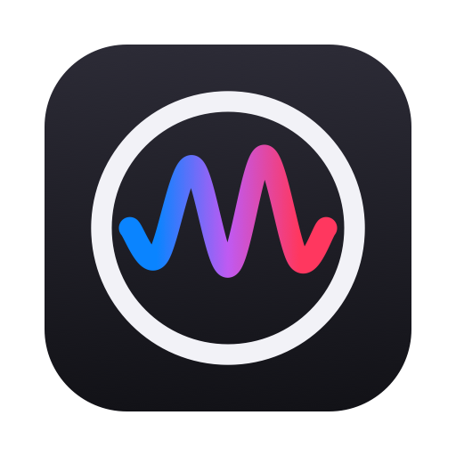

<p align="center">
  
</p>

## VoiceAI

**Hold a key, speak, and the text lands where your cursor is — recognised on your Mac.**
A menu bar dictation app for macOS built on Whisper large-v3-turbo, with Polish as its first language.

[](https://developer.apple.com/xcode/)
[](https://www.apple.com/macos)

<a href="https://github.com/sponsors/mikagosz"></a>

VoiceAI replaces the system dictation, which misspells names and rewrites words on its own.
Speech is recognised locally by Whisper through WhisperKit; nothing is sent anywhere. A word
list keeps names spelled right, a whisper mode picks up very quiet speech, and dictations
made with no text field in focus go to the app's own journal instead of being lost.
VoiceAI can also read Claude Code's replies aloud.

<p align="center">
  
</p>

> The interface is in Polish and English — it follows the Mac, or is picked in Settings.

---

## Using it

| | |
|---|---|
| **Right ⌥ held on its own** | records while held; on release the text is recognised and pasted where the cursor is. Any other key pressed meanwhile (⌥A for „ą”, shortcuts) cancels. Another key — left ⌥, right ⌘, right ⌃, right ⇧ or fn — can be picked in Settings. |
| **Level bar** | a small pill at the bottom of the screen: the app and window the text is going to, and a wave that follows your voice. Can be turned off in Settings. |
| **Menu bar icon** | a coloured wave; lights up and follows your voice while recording, a wave runs through it while recognising, it turns night blue in whisper mode. Small or wide, picked in Settings. |
| **Audio and video files** | menu → **Transcribe Audio or Video File…**, or drop files on the app's icon: the text lands next to the file as `.txt` and `.srt` subtitles, never over an existing file. Several files are done one after another; progress shows in the menu. Long files are read ten minutes at a time. |
| **No text field** | desktop, Finder, a window without a field: the text goes to the **journal** (menu → **Journal…**), optionally also as a Finder file on the desktop. In the journal, select entries and press ⌘C to copy just those. |

## Language model (optional)

Settings → **Language model** downloads Gemma 4 E2B (text-only, 4-bit MLX, 2.7 GB) on request — nothing
is downloaded until you ask. Then:

- **Translate dictation into** — you speak in the speech language, the text lands in another one.
- **Tidy the text** — drops fillers ("yyy", "uh"), repeats and slips, fixes punctuation. Off by default:
  now and then it changes what a sentence means.

**Your own model:** Settings → Language model → **Add Your Own Model…** takes any MLX model from
Hugging Face by name or link (e.g. `mlx-community/Qwen3-4B-4bit`), or an MLX model folder on disk.
Before anything downloads it is checked: the repository must exist, hold `.safetensors` weights
(GGUF files are not MLX) and be of a type MLX Swift runs (Gemma, Qwen, Llama, Mistral, Phi and
about fifty more). Downloaded weights are checked against the SHA-256 Hugging Face publishes. Click a model in the list to use it; the bin moves it to the Trash. Thinking
is switched off and any `<think>` block is cut from the answer.

A translation always tidies first (translated raw, fillers stayed in). Both run on this Mac, about
1–1.5 s a sentence on an M4; the first use after launch adds ~3 s to load the model, and it leaves
memory (≈2.7 GB) after 10 minutes unused.

## Settings

Menu → **Settings…**: the dictation key, the app language (automatic — Polish on a Polish Mac, English everywhere else — or picked by hand), the speech language Whisper listens for, the level bar, whisper mode, the icon style, reading Claude's replies
and the voice (a system voice or a program of your own) with its speed, pitch and volume, per-app rules (full stop at the end, capital first letter, trailing space),
what happens with no text field, updates, and launch at login.

## Updates

Once a month VoiceAI asks fractal8.eu for the newest version number — nothing else is sent. When
there is a newer one, a window offers **Install and Restart**, **Skip This Version** or a manual
download; the app replaces itself only after you click. Switch the check off in Settings, or ask
now with **Check for Updates…** in the menu. Built on [ErrorUpdate](https://github.com/mikagosz/ErrorUpdate).

## Word list

Menu → **Edit Word List…** opens `~/Library/Application Support/VoiceAI/slownik.json`:

- `slowa` — names Whisper should spell right; they go to Whisper as a hint,
- `zamiany` — fixes applied after recognition, whole words, any letter case,
- `aplikacje` — per-app rules by bundle ID (`nazwa`, `kropka`, `wielkaLitera`, `spacja`, own `zamiany`).

Changes apply from the next dictation. A file with a syntax error is never overwritten —
the last good version stays in use and the menu says so.

## Reading Claude Code's replies

Optional. A `Stop` hook in `~/.claude/settings.json` hands every reply to VoiceAI, which reads its first
two sentences aloud with the best Polish system voice (pick another, and its speed, pitch and volume, in Settings; better voices
download in VoiceOver Utility → Speech → Voice → Customize). Pressing the dictation key cuts the voice off.

```json
"Stop": [{ "hooks": [{ "type": "command", "command": "/Applications/VoiceAI.app/Contents/MacOS/VoiceAI --claude-hook", "timeout": 5 }] }]
```

Use the path of your own copy of `VoiceAI.app` in the command.

### Another voice (a program of your own)

Settings → Claude's replies → Voice → **Other Voice (Command)** hands the reading to any program you pick —
a wrapper around a text-to-speech engine of your choice. VoiceAI ships no engine of its own. The program is
started once and kept running, so a slow engine loads its model only once; replies are read sentence by
sentence, the speed, pitch and volume sliders still apply, and the system voice takes over whenever the program
fails or stays silent for two minutes.

The contract: for every sentence VoiceAI writes one line, `language<TAB>text`, to the program's standard input
and waits for one line on its standard output — the path to a WAV file (VoiceAI reads it, then deletes it) or
`BŁĄD: reason`. Anything else goes to standard error.

The program does not get VoiceAI's permissions: macOS would normally let a program an app starts use that
app's microphone and Accessibility access, so VoiceAI starts it as a process of its own, the way Terminal does.
A speech engine needs neither.

## Requirements

- macOS 26 or later, Apple silicon
- Xcode 27 to build
- about 1.5 GB of disk for the Whisper model, plus 2.7 GB for the optional language model

## Installing

Build it from source:

```bash
git clone https://github.com/mikagosz/VoiceAI.git
cd VoiceAI
./build.sh
```

The script runs the headless checks, builds the app, installs it to `~/Applications` and starts it.
It signs the app ad hoc, which is all you need for an app you built yourself. To install into a
different folder, put its path on the first line of a file named `.install-dir` in the project folder.
The first build fetches the Swift packages (WhisperKit, MLX) and takes a few minutes.

The checks can also be run on their own, without Xcode: `./Tests/check.sh`.

## First launch

- VoiceAI downloads the Whisper model (about 1.5 GB) from Hugging Face; the menu shows the
  progress. After that it works without the network.
- macOS asks for the **microphone** — without it VoiceAI hears nothing and says so, with
  **Turn On Microphone…** in its menu.
- macOS asks for **Accessibility**, needed to notice the right ⌥ key and to paste. Until it is
  granted, the text stays on the clipboard and the menu offers **Turn On Accessibility (Pasting and the Key)…**.
- VoiceAI adds itself to Login Items once; switch it off in Settings or in *System Settings →
  General → Login Items* and it stays off.

## Data on disk

All in `~/Library/Application Support/VoiceAI/`: `slownik.json` (word list and app rules),
`dziennik.json` (journal), `Modele/` (Whisper and the language models). Settings and the word
counter live in the app's preferences.

Settings → **Models and files** lists the installed models with their size. **Uninstall VoiceAI…**
at the bottom of Settings asks what to remove (models, word list, journal, settings and cache),
moves it all to the Trash and quits. macOS tells an app nothing when it is dragged to the Trash
while closed; if it is running, VoiceAI notices and asks the same question.

## Privacy

Speech is recognised on your Mac and nothing you say leaves it. VoiceAI connects to the network
only to download models from Hugging Face over HTTPS (Whisper on first launch, a language model
only when you ask for one) and, once a month unless switched off, to read the newest version number
from fractal8.eu. On your Mac it:

- records from the microphone only while the key is held,
- puts the text on the clipboard to paste it, then puts your previous clipboard back,
- writes its word list, journal and models to `~/Library/Application Support/VoiceAI/`,
- with the Claude Code hook set up, reads the reply from the session file Claude Code names
  and hands it over through a file only your user can read,
- with **Other Voice (Command)** picked, starts the program you chose and passes it the sentences to read.

The system log gets errors and counts, never the dictated text.

## Built with

[WhisperKit](https://github.com/argmaxinc/WhisperKit) by Argmax (MIT) running OpenAI's Whisper
large-v3-turbo model. [MLX Swift LM](https://github.com/ml-explore/mlx-swift-lm) by Apple (MIT) with
[swift-transformers](https://github.com/huggingface/swift-transformers) (Apache 2.0) running Google's
Gemma 4 E2B in the [mlx-community text-only conversion](https://huggingface.co/mlx-community/Gemma4-E2B-IT-Text-int4)
(Apache 2.0). Everything else is Apple frameworks. `swift-collections` is held at 1.3 — 1.7.1 does not
compile with Swift 6.4 (Xcode 27 beta).
